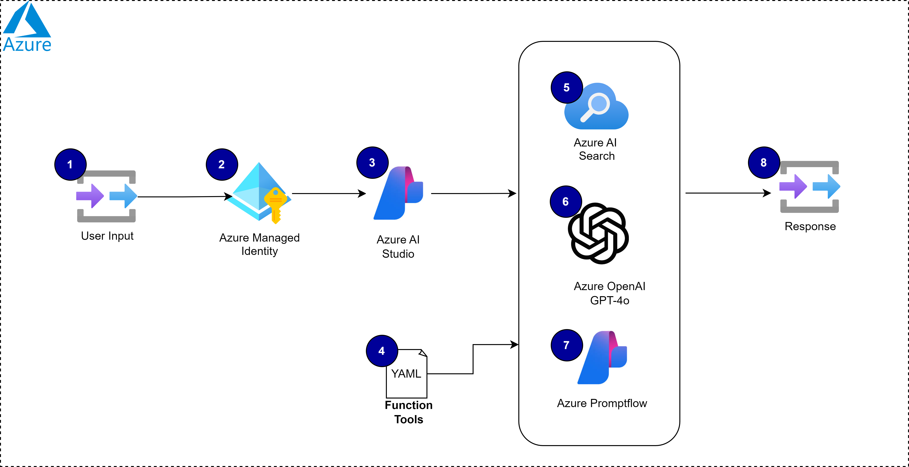
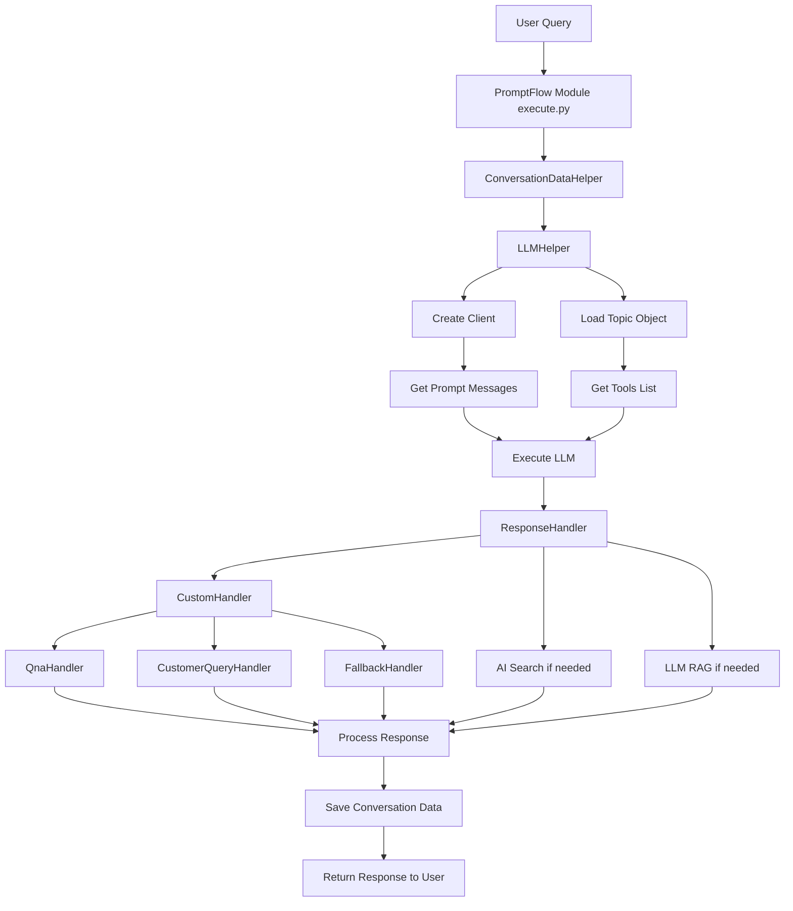
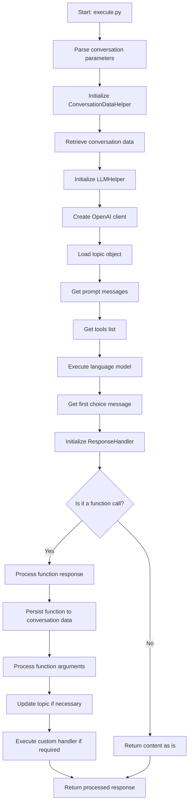

# Table of Contents

- [Azure Prompt Flow Accelerator Project](#azure-prompt-flow-accelerator-project)
  - [Overview](#overview)
  - [Business Objectives](#business-objectives)
  - [Why Do We Need Promptflow?](#why-do-we-need-promptflow)
  - [High Level Architecture](#high-level-architecture)
  - [Features](#features)
  - [Function Calling with OpenAI](#function-calling-with-openai)
  - [Content Safety](#content-safety)
  - [Getting Started](#getting-started)
  - [Running the Project](#running-the-project)
  - [Technical Walkthrough](#technical-walkthrough)
    - [Class Interactions Overview](#class-interactions-overview)
    - [Business Function: topic_area -> Customer Service](#business-function-topic_area--customer-service)
      - [default.yaml](#defaultyaml)
      - [customerQuery.yaml](#customerqueryyaml)
  - [Costs [In Progress]](#costs-in-progress)
  - [Deployment [In Progress]](#deployment-in-progress)
  - [Security](#security)
  - [Resources](#resources)
  - [Troubleshooting](#troubleshooting)
  - [Contributing](#contributing)
  - [Trademarks](#trademarks)

# Azure Prompt Flow Accelerator Project


## About This Sample

In this sample Promptflow, we build, evaluate, and deploy a customer support Gen AI backend for Contoso Outdoors, a fictitious retailer who sells hiking and camping equipment. The implementation uses Promptflow for all Gen AI orchestration needs, a Retrieval Augmented Generation (RAG) architecture to implement a retail chat assistant solution that responds to customer queries with answers grounded in the company's product catalog, customer purchase history, and customer information.

The sample uses Azure AI Search to create and manage search indexes for product catalog data, local files (could be replaced by Azure Cosmos DB) to store and manage customer purchase history data, and Azure OpenAI to deploy and manage the core models required for our RAG-based architecture.

By exploring and deploying this sample, you will learn to:

- Define and orchestrate Gen AI Application using the [Prompt Flow](https://microsoft.github.io/promptflow/concepts/concept-flows.html).
- Build a retail copilot application using the [_RAG pattern_](https://learn.microsoft.com/azure/ai-studio/concepts/retrieval-augmented-generation).
- Provision and deploy the solution to Azure using the Azure Developer CLI.
- Test at scale using Azure AI Studio capabilities in terms of batch runs and evaluations [Azure AI Studio](https://learn.microsoft.com/en-us/azure/ai-studio/concepts/evaluation-approach-gen-ai)
- Understand and apply Responsible AI practices like [_evaluation and content safety_](https://learn.microsoft.com/en-us/azure/ai-services/responsible-use-of-ai-overview?context=%2Fazure%2Fai-studio%2Fcontext%2Fcontext).

## Project Overview

This project implements an advanced AI-powered assistant for a hiking gear e-commerce platform. It leverages a sophisticated orchestration pattern that allows it to select at runtime specific topic area and only consume context that is relevant to specific task at hand.

For example, if User is being greeted, we will start with **Default** topic area, meaning only functions (tools) that are needed there are being passed through to LLM, saving valuable tokens and ensuring that context window is as small as possible.

Key Features:

- Conversational AI: Manages multi-turn conversations using Azure OpenAI integration.
- Modular design: Topic areas are used to construe prompts at runtime, ensuring maximum efficiency and operational flexibility.
- Multi-lingual Support: Responds in the user's specified language.
- Fallback Mechanisms: Gracefully handles queries outside its knowledge base.
- Topic-Based Conversation Flow: Uses YAML-defined topics to guide interactions.
- Semantic Product Search: Utilizes AI to search and retrieve relevant hiking product information.
- Customer Information Management: Securely handles and retrieves customer data for personalized interactions.


## Business Objectives

- **Efficiency and Agility:** Promptflow allows businesses to quickly create and iterate on AI models, reducing the time from ideation to deployment.
- **Collaboration:** Supports team collaboration, enabling multiple users to work together on projects, share knowledge, and maintain version control.
- **Evaluation and Optimization:** Built-in evaluation tools help assess the quality and effectiveness of AI models, ensuring they meet business requirements.
- **Scalability:** Deploy AI models as real-time endpoints, making it easier to scale and integrate into existing systems.
- **Comprehensive Resources:** Includes a library of built-in tools, samples, and templates, which can inspire creativity and accelerate development.

By leveraging Promptflow, businesses can enhance their AI capabilities, improve productivity, and stay competitive in the rapidly evolving AI landscape.


## High Level Architecture

### Functional Highlights

- Built on PromptFlow for conversation management
- Integrates Azure OpenAI for RAG
- Implements modular LLM helpers for optimized AI interactions
- Uses YAML for configuration and data storage
- Includes robust error handling and logging
- Supports different LLMs and SLMs for execution of prompts
- Custom business logic is delivered using handlers, meaning maximum efficiency and flexibility


## Components 

| #  | Component                                                                                                                                             | Description                                                                                                                                                                | Role/Functionality                                                                                                                                                                                                                                                                           |
|----|-------------------------------------------------------------------------------------------------------------------------------------------------------|----------------------------------------------------------------------------------------------------------------------------------------------------------------------------|-------------------------------------------------------------------------------------------------------------------------------------------------------------------------------------------------------------------------------------------------------------------------------------------------------------------------------------|
| 1  | User Input                                                                                                                                           | This is query/message from user, chat_history (auto generated within Promptflow) and a set of Conversation Parameters (JSON object)                                                                                                            | Acts as the starting point for interactions, allowing users to submit their queries or chat with the AI assistant.                                                                                                                                                                                                                  |
| 2  | [Azure Managed Identity](https://learn.microsoft.com/en-us/azure/active-directory/managed-identities-azure-resources/overview)                         | A feature of Azure Active Directory that provides Azure services with an automatically managed identity in Azure AD.                                                      | Allows the application to securely access Azure services like Azure AI Studio and Azure OpenAI without managing credentials explicitly.                                                                                                                                                                                             |
| 3  | [Azure AI Studio](https://learn.microsoft.com/en-us/azure/cognitive-services/)                                                                         | A suite of AI services and tools offered by Azure to build, deploy, and manage AI solutions.                                                                               | Provides the environment for building, training, and deploying AI models. It also supports creating and managing AI resources needed for the project.                                                                                                                                                                               |
| 4  | YAML Function Tools                                                                                                                                  | Configuration files defining functions and workflows in a structured format.                                                                                              | Defines and manages the functions and workflows that the AI assistant uses to process user inputs and generate responses.                                                                                                                                                                                                             |
| 5  | [Azure OpenAI](https://learn.microsoft.com/en-us/azure/ai-services/openai/)                                                                            | Provides access to OpenAI's models, including GPT-4, for natural language processing tasks.                                                                                | Handles processing and generating responses to user queries, leveraging advanced language models for accurate and contextual replies.                                                                                                                                                                                                |
| 6  | [Azure Prompt Flow](https://microsoft.github.io/promptflow/concepts/concept-flows.html)                                                                | A tool that simplifies the development, debugging, and deployment of prompt-based AI applications.                                                                        | Orchestrates the workflow of prompts and functions, ensuring the correct sequence of operations and managing the interactions between various components to produce the final output.                                                                                                                                                 |
| 7  | [Azure AI Search](https://learn.microsoft.com/en-us/azure/search/)                                                                                     | A powerful search-as-a-service solution to create rich search experiences.                                                                                                | Enhances the AI assistant's ability to retrieve relevant information from the company's product catalog, customer purchase history, and other data sources, ensuring responses are accurate and contextually relevant.                                                                                                               |
| 8  | Query Response                                                                                                                                       | The output generated by the AI assistant in response to user inputs.                                                                                                       | Provides the final response to the user, which could be answers to queries, information retrieval from databases, or conversational interactions, ensuring that the user's needs are met accurately and efficiently.                                                                                                                |

> [!IMPORTANT]
> We do not guarantee the quality of responses produced by these samples or their suitability for use in your scenarios, and responses will vary as development of the samples is ongoing. You must perform your own validation the outputs of the application and its suitability for use within your company.

## Technical Walkthrough

### Key Components and Features

#### 1. Conversation Management
- Utilizes PromptFlow module for efficient conversation handling
- Manages diverse query types: customer information, product Q&A, customer information
- Maintains conversation history for context-aware interactions
- Adapts dynamically to different conversation topics

#### 2. Language Model Integration
- Seamless integration with Azure OpenAI for advanced natural language processing
- Custom LLMHelper class for optimized language model interactions

#### 3. AI-Powered Search Capability
- Leverages Azure AI search for all RAG needs
- Implements semantic search for enhanced result relevance
- Capable of searching and retrieving pre-indexed product data

#### 4. Customer Information Management
- Efficient handling of customer queries using a secure database (in the sample these are simply stored locally, but can be extended to function with SQL, CosmosDB or any cloud-enabled DB system with API)
- Demonstrates data storage and retrieval using YAML files (for demo purposes)

#### 5. Fallback Mechanisms
- Implements fallback handlers for graceful management of unanswerable queries

#### 6. Topic-Based Conversation Flow
- Utilizes YAML-defined topics (default, customerQuery) for structured conversations

#### 7. Enhanced Safety and Error Handling
- Integrates Azure AI Content Safety for content moderation
- Comprehensive error logging system for improved reliability

#### 8. Customization Capabilities
- Supports custom handlers and connections for versatile use case adaptation

#### 9. Multi-Language Support
- Designed to respond in the user's specified locale for a global user base

### Technical Highlights

- **Framework**: Built on PromptFlow for advanced conversation management
- **AI Integration**: Leverages Azure OpenAI and Azure AI Search
- **Data Management**: Utilizes YAML for configuration and demo data storage
- **Architecture**: Modular design with custom handlers for specialized business logic
- **Safety**: Incorporates Azure AI Content Safety for secure interactions


### Class Interactions Overview

- **LMHelper:** Base class providing common methods for language model interactions.
- **LLMHelper:** Inherits from LMHelper; manages language model interactions and tool listings.
- **SLMHelper:** Inherits from LMHelper; focuses on specific language model execution.
- **ResponseHandler:** Manages response messages; includes a nested Processor for detailed tasks.
- **Processor:** Handles processing tasks such as function responses and data persistence.
- **SearchAiExecutor:** Executes search-related tasks; used by AiSearch.
- **AiSearch:** Encapsulates AI search logic; works with SearchAiExecutor for search tasks.
- **LlmRag:** Manages LLM operations for Q&A; interacts with LLMHelper.
- **ConversationDataHelper:** Manages conversation data.
- **execute:** Main function integrating various components.
- **CustomHandler:** Parses tool functions.
- **CustomerQueryHandler:** Handles customer queries.
- **FallbackHandler:** Manages fallback scenarios.
- **QnaHandler:** Handles Q&A operations.

### High Level Diagram



### OpenAI Function Calling:

The project uses [OpenAI function calling](https://platform.openai.com/docs/guides/function-calling), which allows for more structured interactions with the LLM. It crucially allows us to shape the "context" of LLM without expanding the tokent count. When used with GPT4o it also ensures that we get our responses in very strict format, meaning custom business logic is easy to parse and execute on.

### Standard Functions

These are general-purpose functions used across different conversation topics:

1. **end_conversation.yaml**
   ```markdown
   - Purpose: Concludes the conversation when the user is satisfied or has no further inquiries.
   - Key parameters:
     - resettopics: Resets the conversation topic to 'default'.
     - response: Generates a thank you message or apology.
   ```

2. **greet.yaml**
   ```markdown
   - Purpose: Handles standard greetings and ad-hoc messages.
   - Key parameters:
     - response: Generates a friendly, helpful response to the user's greeting or message.
   ```

3. **frustration.yaml**
   ```markdown
   - Purpose: Manages situations where the user is frustrated and needs human assistance.
   - Key parameters:
     - response: Generates an apology and offers to connect with a human assistant.
   ```

4. **fallback.yaml**
   ```markdown
   - Purpose: Handles situations where the user wants to change the current topic.
   - Key parameters:
     - response: Informs the user about potentially continuing from where they left off.
   ```

### Custom Customer Service Functions

These functions are tailored for specific e-commerce scenarios:

1. **default.yaml**
   ```markdown
   - Purpose: Serves as the initial conversation handler and topic identifier.
   - Key functions:
     - identify_topic: Determines the user's intent (customer query etc.).
     - qna: Handles general product or hiking-related questions.
   - Parameters include topic_name and response for different scenarios.
   ```

2. **customerQuery.yaml**
   ```markdown
   - Purpose: Manages customer information inquiries.
   - Key function: customerQuery
   - Parameters:
     - query: Concise version of the user's request.
     - email: Customer's email for identification.
   - Includes fallback handling and frustration detection.
   ```


### Implementation and Usage

- These functions are defined in YAML files and loaded into the system.
- The `LLMHelper` class (in `llm_helper.py`) uses these function definitions when interacting with the language model.
- The `ResponseHandler` class (in `response_handler.py`) processes the model's responses, including function calls.
- Custom handlers (e.g., `CustomerQueryHandler`) in the project execute the business logic associated with each function call.



## Costs
Pricing for services may vary by region and usage and exact costs cannot be estimated. This is just a guided reference about the components. You can estimate the cost of this project's architecture with Azure's pricing calculator with these services:

- **Azure OpenAI:** Standard tier, GPT-4, GPT-35-turbo, and Ada models. [See Pricing](https://azure.microsoft.com/en-us/pricing/details/cognitive-services/openai-service/)
- **Azure AI Search:** Basic tier, Semantic Ranker enabled. [See Pricing](https://azure.microsoft.com/en-us/pricing/details/search/)
- **Azure Cosmos DB for NoSQL:** Serverless, Free Tier. [See Pricing](https://azure.microsoft.com/en-us/pricing/details/cosmos-db/)

## Function Calling with OpenAI

Function calling allows AI models to execute predefined functions based on user inputs, enhancing interactivity and utility by enabling dynamic actions like database queries, API interactions, or task automation. For more details, check this [link](https://platform.openai.com/docs/guides/function-calling).

### Usage in the Project
The project uses function calling extensively, defined through various YAML files that configure both standard tools and custom topics:

- **Standard Tool Functions (`standard_tool_functions`):**
  - **`end_conversation.yaml`:** Ends a conversation gracefully.
  - **`fallback.yaml`:** Provides fallback responses for unhandled queries.
  - **`frustration.yaml`:** Manages user frustration responses.
  - **`greet.yaml`:** Defines greeting responses to start conversations.
  - **`qna.yaml`:** Manages question and answer interactions for accurate responses.

- **Custom Topic Functions (`persona-public\topic_area_customerService`):**
  - **`customerQuery.yaml`:** Handles general customer queries.
  - **`default.yaml`:** Default settings and responses for customer service interactions.

## 🛡️ Content Safety

Content safety is crucial in Generative AI (GenAI) applications to prevent the generation of harmful, offensive, or inappropriate content. Azure AI Content Safety Studio is an online tool designed to help manage potentially offensive, risky, or undesirable content using advanced content moderation machine learning models. It offers templates and customizable workflows, allowing users to build their own content moderation systems.

### Key Features of Content Safety Studio

- **Analyze Text Content:** Quickly test text moderation, configure filters, and use blocklists to manage content.
- **Detect User Input Attacks:** Identify prompts designed to provoke generative AI models into undesirable behaviors.
- **Analyze Image Content:** Test image moderation capabilities to handle sensitive or inappropriate images.

> [!IMPORTANT]
> This is an example of content safety and you may need to change, update, add, or delete based on your use case.

### `content_safety_system_prompt.txt` File
This file contains guidelines that the AI must follow to ensure safe and appropriate interactions. For example:
```
Do not express opinions.
Do not engage in discussions of politics or religion.
```

### Sample Code from `lm_helper.py`
The following functions in `lm_helper.py` utilize the content safety prompt:

```python
def get_system_prompt_message(self) -> str:
    """
    Construct the system prompt message for the language model.
    
    Returns:
        str: The system prompt message.
    """
    system_prompt: str = self.topic_object["systemPrompt"] + " \n"
    system_prompt += "Only use the functions you have been provided with. \n"
    system_prompt += "Known details for each function can be found in the JSON object provided. \n"
    system_prompt += json.dumps(self.conversation_data) + " \n\n"
    system_prompt += self.get_safety_prompt() + " \n\n"
    system_prompt += (
        "Your response must be in the language defined by the locale `"
        + self.conversation_parameters["locale"]
        + "`."
    )

    return system_prompt

def get_safety_prompt(self) -> str:
    """
    Retrieve the content safety system prompt from a file.
    
    Returns:
        str: The content safety system prompt.
    """
    with open("content_safety_system_prompt.txt", "r", encoding="utf-8") as file:
        data = file.read()

    return data
```

## 🚀 Getting Started

### Prerequisites
- **Azure Account:** An active Azure account with access to Azure OpenAI.
- **Python Environment:** Python 3.9 or higher, up to Python 3.11.
- **Dependencies:** Install required Python packages using `pip`.

### Installation
1. **Clone the Repository:**
   ```bash
   git clone <repository-url>
   cd <repository-directory>
   ```

2. **Install Dependencies:**
   ```bash
   pip install promptflow promptflow-tools
   ```

### Quick Start ⚡

#### Create a Chatbot with Prompt Flow
Run the command to initiate a prompt flow from a chat template. This creates a folder named `my_chatbot` and generates the required files within it:
```bash
pf flow init --flow ./my_chatbot --type chat
```

#### Setup a Connection for Your API Key
For OpenAI key, establish a connection by running the command using the `openai.yaml` file in the `my_chatbot` folder, which stores your OpenAI key (override keys and name with `--set` to avoid yaml file changes):
```bash
pf connection create --file ./my_chatbot/openai.yaml --set api_key=<your_api_key> --name open_ai_connection
```

For Azure OpenAI key, establish the connection by running the command using the `azure_openai.yaml` file:
```bash
pf connection create --file ./my_chatbot/azure_openai.yaml --set api_key=<your_api_key> api_base=<your_api_base> --name open_ai_connection
```

#### Chat with Your Flow
In the `my_chatbot` folder, there's a `flow.dag.yaml` file that outlines the flow, including inputs/outputs, nodes, connection, and the LLM model, etc.

Note that in the chat node, we're using a connection named `open_ai_connection` (specified in the connection field) and the `gpt-35-turbo` model (specified in the deployment_name field). The `deployment_name` field is to specify the OpenAI model or the Azure OpenAI deployment resource.

Interact with your chatbot by running: (press Ctrl + C to end the session)
```bash
pf flow test --flow ./my_chatbot --interactive
```

## ▶️ Running the Project

### Running the Prompt Flow Code
To run the prompt flow code, use the following command:
```bash
python.exe -m promptflow._cli._pf.entry flow test --flow prompt-flow-project --user-agent "prompt-flow-extension/1.20.0 (win32; x64) VSCode/1.91.1"
```

To test the flow with a specific query:
```

bash
pf flow test --flow flow:chat --inputs question="What's the capital of France?"
```

### Test Flow
Customers can use CLI or VS Code extension to test the flow.

#### CLI
Test the flow using:
```bash
pf flow test --flow <flow-name>
```

#### Test with Interactive Mode
Promptflow CLI provides a way to start an interactive chat session for chat flow. Customers can use the following command to start an interactive chat session:
```bash
pf flow test --flow <flow-name> --interactive
```

For more info, check this [link](https://microsoft.github.io/promptflow/how-to-guides/develop-a-flex-flow/index.html).


## 🚀 Deployment [In Progress]

Deployment steps and guidance for this project are currently in progress. Stay tuned for detailed instructions on how to deploy the Azure Prompt Flow Accelerator Project.

## 🚀 Evaluate [In Progress]

In the project we have attached one sample file that can be used to execute a batch run of a promptflow.

 In order to learn about Promptflow evaluation capabilities, please follow this [guide](https://learn.microsoft.com/en-us/azure/ai-studio/concepts/evaluation-approach-gen-ai).


```
The JSONL file can be found in Data, under test_data folder.
```


## 🛡️ Security
This template uses Managed Identity for authentication with key Azure services including Azure OpenAI, Azure AI Search, and Azure Cosmos DB. Applications can use managed identities to obtain Microsoft Entra tokens without having to manage any credentials. This also removes the need for developers to manage these credentials themselves and reduces their complexity.

Additionally, we have added a GitHub Action tool that scans the infrastructure-as-code files and generates a report containing any detected issues. To ensure best practices we recommend anyone creating solutions based on our templates ensure that the GitHub secret scanning setting is enabled in your repo.

## 📚 Resources
- [Azure AI Studio Documentation](https://docs.microsoft.com/en-us/azure/cognitive-services/)
- [Promptflow/Prompty Documentation](https://promptflow.com/docs/)
- [Develop Python apps that use Azure AI services](https://docs.microsoft.com/en-us/azure/developer/python/)

## ❓ Troubleshooting
Have questions or issues to report? Please open a new issue after first verifying that the same question or issue has not already been reported. In the latter case, please add any additional comments you may have, to the existing issue.

## Contributing [In Progress]

## Trademarks
This project may contain trademarks or logos for projects, products, or services. Authorized use of Microsoft trademarks or logos is subject to and must follow [Microsoft's Trademark & Brand Guidelines](https://www.microsoft.com/en-us/legal/intellectualproperty/trademarks/usage/general.aspx). Use of Microsoft trademarks or logos in modified versions of this project must not cause confusion or imply Microsoft sponsorship. Any use of third-party trademarks or logos are subject to those third-party's policies.

